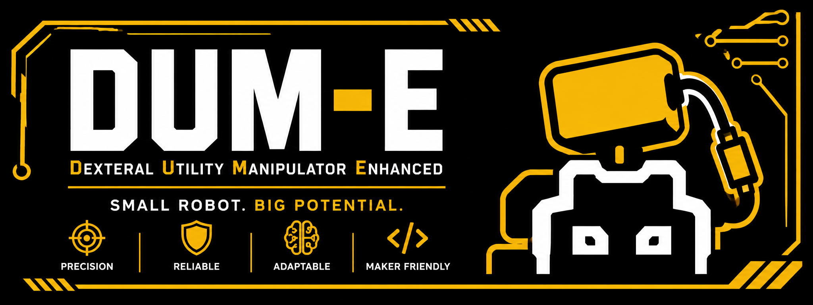
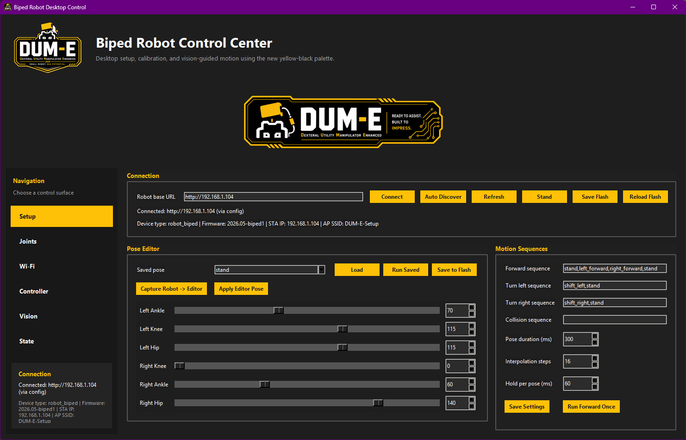
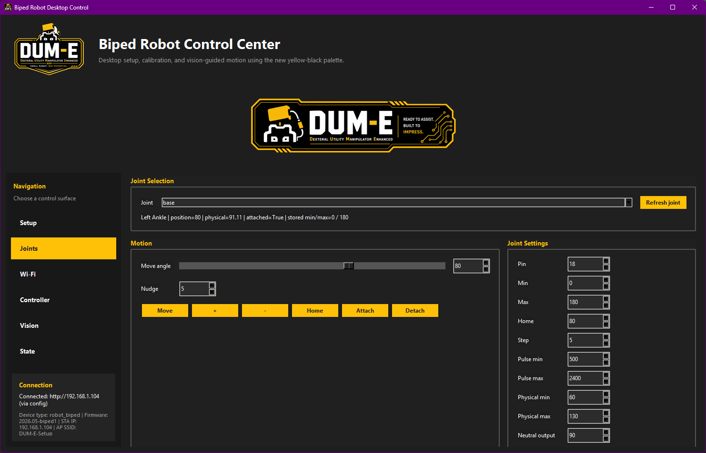
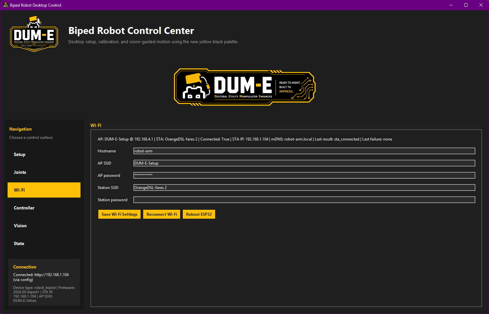
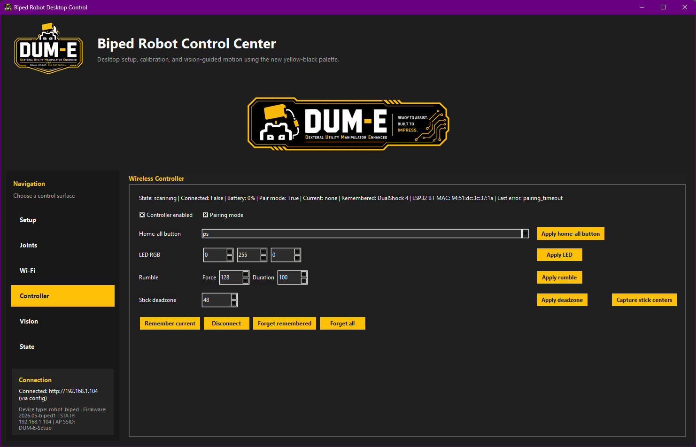
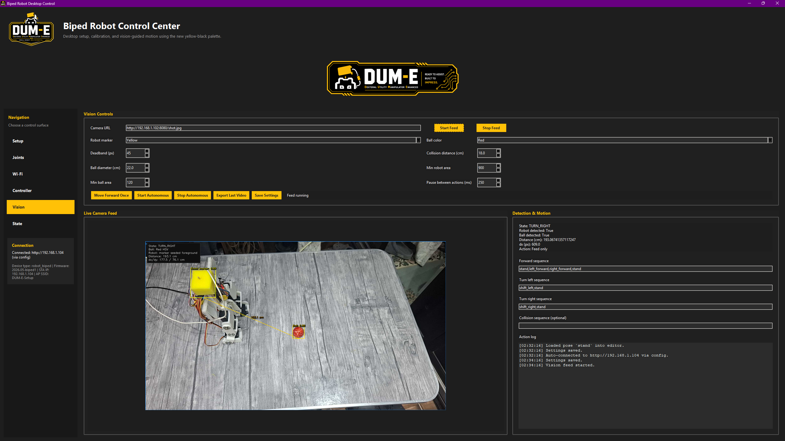
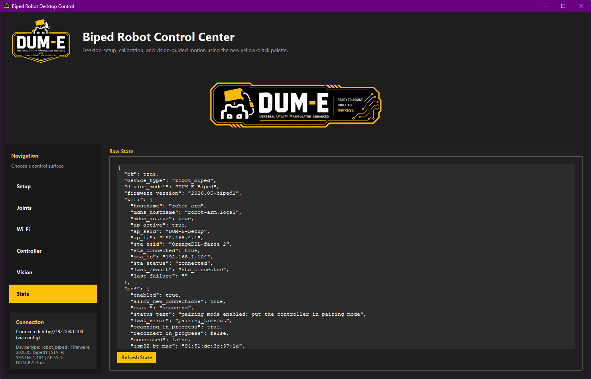

# Biped Robot Control System

An ESP32-based six-servo biped robot with:

- a desktop control app for calibration, pose editing, and operator workflows
- a Streamlit dashboard for advanced diagnostics and experimentation
- color-based computer vision for robot-and-ball tracking
- autonomous forward movement until ball collision

## Highlights

- Automatic device discovery on the local network
- Flash-backed pose storage and sequence playback
- Per-joint calibration and physical-angle mapping
- Live annotated camera feed from Android IP Webcam
- Yellow-marker robot detection and red-ball detection
- Video recording and export for autonomous runs

## Robot Mapping

The firmware keeps legacy HTTP joint ids, but they map to the biped legs as follows:

| API name | Physical joint |
|---|---|
| `base` | Left Ankle |
| `shoulder` | Left Knee |
| `elbow` | Left Hip |
| `wrist_pitch` | Right Knee |
| `wrist_rotate` | Right Ankle |
| `gripper` | Right Hip |

All six servos are configured as `positional_180`.

Current stand pose:

| Joint | Angle |
|---|---:|
| Left Ankle | 80 |
| Left Knee | 90 |
| Left Hip | 110 |
| Right Knee | 25 |
| Right Ankle | 40 |
| Right Hip | 135 |

## Main Interfaces

### Desktop app

Primary operator app:

- [`biped_desktop_app.py`](biped_desktop_app.py)
- launched with [`biped_desktop_app.bat`](biped_desktop_app.bat)

Main capabilities:

- connection and automatic discovery
- flash save and reload
- pose editing and sequence tuning
- per-joint control and calibration
- Wi-Fi and controller configuration
- live vision feed
- autonomous forward-until-collision mode

### Streamlit dashboard

Advanced dashboard:

- [`streamlit_app.py`](streamlit_app.py)
- launched with [`biped_streamlit_dashboard.bat`](biped_streamlit_dashboard.bat)

Useful for:

- deeper diagnostics
- sequence recorder workflows
- gait experiments
- lower-level HTTP visibility

## Default Motion Workflow

The current forward motion sequence is:

`stand,left_forward,right_forward,stand`

This sequence is tuned on the real robot and used by the vision workflow as the default forward action.

## Vision Workflow

Vision modules:

- [`biped_vision_camera.py`](biped_vision_camera.py)
- [`biped_vision_tracking.py`](biped_vision_tracking.py)

Behavior:

- detect the yellow robot marker
- detect the red ball
- estimate robot-to-ball distance from image geometry
- keep moving forward while both are visible and distance is above the collision threshold
- stop automatically when the collision threshold is reached

## Project Structure

- [`biped_robot.ino`](biped_robot.ino) — ESP32 firmware
- [`biped_desktop_app.py`](biped_desktop_app.py) — primary desktop operator app
- [`streamlit_app.py`](streamlit_app.py) — advanced dashboard
- [`biped_endpoint_discovery.py`](biped_endpoint_discovery.py) — shared network discovery
- [`biped_gait_phase.py`](biped_gait_phase.py) — host-side gait helpers
- [`output/`](output/) — poster, screenshots, and demo video
- [`REPORT.md`](REPORT.md) — report source
- [`INSTALLATION.md`](INSTALLATION.md) — setup guide

## Screenshots

### Setup

### Joint Calibration

### Wi-Fi

### Controller

### Vision

### State

## Deliverables

- Poster: [`output/poster.jpeg`](output/poster.jpeg)
- Demo video: [`output/vision_recordings/autonomy_20260513_232641.mp4`](output/vision_recordings/autonomy_20260513_232641.mp4)
- Report source: [`REPORT.md`](REPORT.md)

## Setup

See [`INSTALLATION.md`](INSTALLATION.md).

## License

This project is released under the [`MIT License`](LICENSE).
